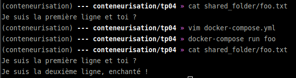

# Conteneurisation M2 TP04

## Initiation à Docker-compose

* [docker-compose.yml](docker-compose.yml)
* commands
```bash
(conteneurisation) --- conteneurisation/tp04 » cat shared_folder/foo.txt
Je suis la première ligne et toi ?
(conteneurisation) --- conteneurisation/tp04 » docker-compose run foo   
(conteneurisation) --- conteneurisation/tp04 » cat shared_folder/foo.txt
Je suis la première ligne et toi ?
Je suis la deuxième ligne, enchanté !
```
* proof

